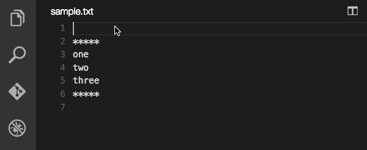

# Filter Text extension for Visual Studio Code

This extension filters selected text through an external shell command inplace or into temp file.
It brings the power of Unix commands such as `sort` and `uniq` into your VS Code editor.

## Usage

* Select text that you want to filter.
* Press `Ctrl+K Ctrl+F` (or press `F1` and run the command named `Filter Text Inplace`).
* Type shell command like `sort -r` and press enter.
* It replaces the selected text with the text from stdout of the command.

### NOTE

* If you didn't select anything, it simply inserts the result text at the current cursor position.
* If you selected `Filter Text` command it opens temp editor with the result

## Changes

* 01/14/2018: v0.0.7 - Set current working directory for the command to match the opened directory
* 12/25/2017: v0.0.6 - Pipe support
* 07/20/2017: v0.0.5 - Make temp buffer a vscode tmp doc instead of system tmp file
* 07/19/2017: v0.0.4 - Allow filter buffer if no selection
* 04/01/2017: v0.0.3 - Added ability to feed result into temp file
* 11/24/2015: v0.0.2 - Changed the keybindg from `Ctrl+Shift+F` to `Ctrl+K Ctrl+F`.
* 11/23/2015: v0.0.1 - Initial release.

## License

[MIT](https://github.com/yhirose/vscode-filtertext/blob/master/LICENSE)
